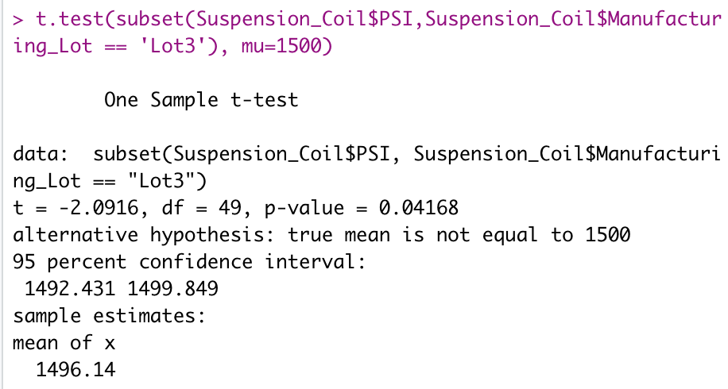

# MechaCar Statistical Analysis: R / R Studio Analysis

A classwork example in which R / R Studio is used to review production data for insights to help a manufacturing team

---

# Overview of Project
This is where the overview of the project will go

## Purpose
This is where the purpose will go

---
# Summary
## Linear Regression to Predict MPG
After performing a multiple linear regression to predict MPG based on vechicle weight, length, spoiler angle, ground clearance, and whether or not the car has all-wheel drive, we receive this output:

* Based on their p-values, vehicle length and ground clearance provide a non-random amount of variance to the MPG valuess in the data. Both p-values were less than 0.05, suggesting significance. 
* The slope of the linear model is considered to be positive - not zero. This is because each coefficent (excluding all-wheel drive) has a positive coefficient. 
* This model does not predict MPG of MechaCar prototypes effectively. If we use the plot() function on the multiple linear regression model we will see that there is not constant variation in the residual plot. The adjusted R-squared is also not ideal - it is only 0.6825 (out of a possible 1). However, we could refine this model. We could drop the variable "spoiler_angle" because it has the largest p-value. Then retest. If the conditions are met with the resulting model, then that model could help predict MPG more accurately. If conditions are not met, we could continue to drop variables with p-values above 0.05 (AWD, then vehicle_weight) to attempt to meet conditions. 

## Summary Statistics on Suspension Coils
The design specifications for the MechaCar suspension coils dictate that the variance of the suspension coils must not exceed 100 pounds per square inch. The current manufacturing data suggests that this design specification for all manufacturing lots in total is met, however one lot individually did not meet this design specification. Lot 3 has a 170.2861224 variance, well above the 100 pounds per quare inch maximum.

### Total summary statistics for all manufacturing lots: Suspension Coil PSI Output

### Individual manufacturing lot summary statistics: Suspension Coil PSI Output

## T-Tests on Suspension Coils
After performing t-tests to determine if the PSI across all manufacturing lots is statistically different from the population mean of 1,500 pounds per square inch, I have come to the following conclusions:
* Based on a p-value of 0.06028, there is not enough evidence to reject the null hypothesis, therefore we will fail to reject the null. This indicates that the PSI across all manufacturing lots has the same PSI as the population mean.
* Based on a p-value of 1, there is strong evidence to fail to reject the null hypothesis. This indicates that Lot 1 has the same PSI as the population mean.
* Based on a p-value of 0.6072, there is strong evidence to fail to reject the null hypothesis. This indicates that Lot 2 has the same PSI as the population mean.
* Based on a p-value of 0.04168, there is some evidence to reject the null hypothesis. This indicates Lot 3 does not have the same PSI as the population mean.

### T-test for all manufacturing lots: Suspension Coil PSI Mean vs 1,500 PSI 

### Individual manufacturing lot t-tests: Suspension Coil PSI Mean vs 1,500 PSI

## Study Design: MechaCar vs Competition
This is where the study for part 4 will go
