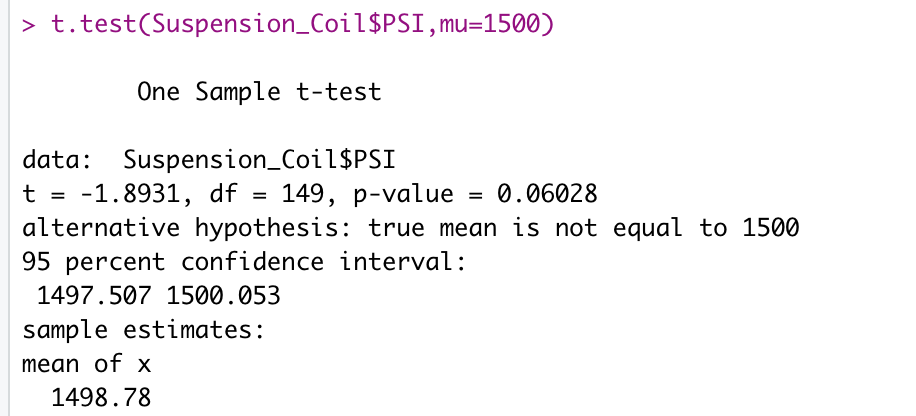
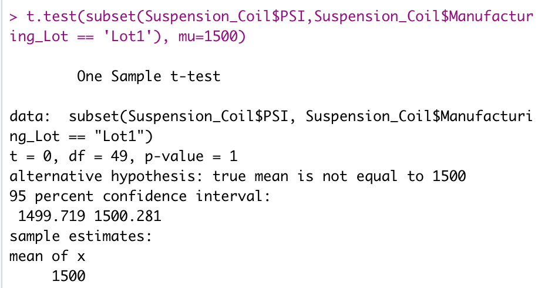
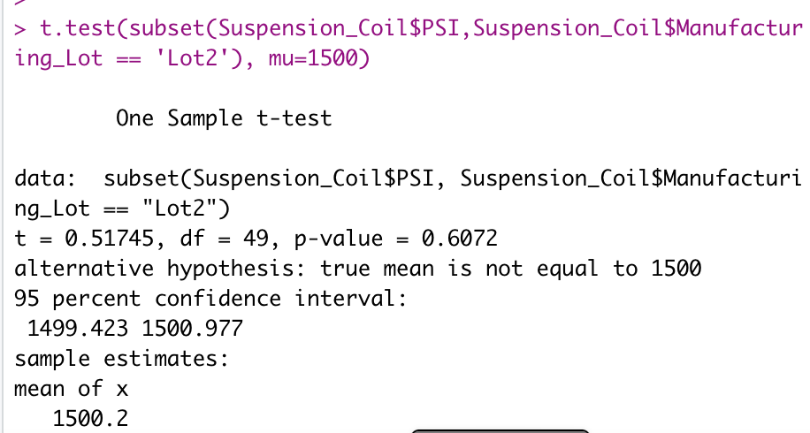

# MechaCar Statistical Analysis: R / R Studio Analysis

A classwork example in which R / R Studio is used to review production data for insights to help a manufacturing team

---

# Overview of Project
The MechaCar, "a prototype car of the AutoRUs company", team needed assistance analyzing historical data to assist with decision making in the present and future. Production troubles are currently causing a bottleneck in the manufacturing team's efficiency. With the help of data, we will be able to identify seveal weak points in production in hopes of upping efficiency to meet quotas. 

## Purpose
I will extract, transform, and load (ETL) data, visualize the data, and analyze the data using R to create helpful insights for the MechaCar company. I will also suggest strategies to keep in mind for a revised study design. 

---
# Summary
## Linear Regression to Predict MPG
After performing a multiple linear regression to predict MPG based on vechicle weight, length, spoiler angle, ground clearance, and whether or not the car has all-wheel drive, we receive this output:

* Based on their p-values, vehicle length and ground clearance provide a non-random amount of variance to the MPG valuess in the data. Both p-values were less than 0.05, suggesting significance. 
* The slope of the linear model is considered to be positive - not zero. This is because each coefficent (excluding all-wheel drive) has a positive coefficient. 
* This model does not predict MPG of MechaCar prototypes effectively. If we use the plot() function on the multiple linear regression model we will see that there is not constant variation in the residual plot. The adjusted R-squared is also not ideal - it is only 0.6825 (out of a possible 1). However, we could refine this model. We could drop the variable "spoiler_angle" because it has the largest p-value. Then retest. If the conditions are met with the resulting model, then that model could help predict MPG more accurately. If conditions are not met, we could continue to drop variables with p-values above 0.05 (AWD, then vehicle_weight) to attempt to meet conditions. 

## Summary Statistics on Suspension Coils
The design specifications for the MechaCar suspension coils dictate that the variance of the suspension coils must not exceed 100 pounds per square inch. The current manufacturing data suggests that this design specification for all manufacturing lots in total is met, however one lot individually did not meet this design specification. Lot 3 has a 170.2861224 variance, well above the 100 pounds per quare inch maximum.

### Total summary statistics for all manufacturing lots: Suspension Coil PSI Output

### Individual manufacturing lot summary statistics: Suspension Coil PSI Output

## T-Tests on Suspension Coils
After performing t-tests to determine if the PSI across all manufacturing lots is statistically different from the population mean of 1,500 pounds per square inch, I have come to the following conclusions:
* Based on a p-value of 0.06028, there is not enough evidence to reject the null hypothesis, therefore we will fail to reject the null. This indicates that the PSI across all manufacturing lots has the same PSI as the population mean.
* Based on a p-value of 1, there is strong evidence to fail to reject the null hypothesis. This indicates that Lot 1 has the same PSI as the population mean.
* Based on a p-value of 0.6072, there is strong evidence to fail to reject the null hypothesis. This indicates that Lot 2 has the same PSI as the population mean.
* Based on a p-value of 0.04168, there is some evidence to reject the null hypothesis. This indicates Lot 3 does not have the same PSI as the population mean.

### T-test for all manufacturing lots: Suspension Coil PSI Mean vs 1,500 PSI 

### Individual manufacturing lot t-tests: Suspension Coil PSI Mean vs 1,500 PSI

## Study Design: MechaCar vs Competition
We could create a statistical study to quantify how the MechaCar performs against other competative companies. Some example of metrics that a customer would be interested in: specifications (like number of doors, seats, electric features, engine type), cost, size, fuel efficiency, color, horse power, maintenance cost, safety rating, etc. 

When considering performance, we could approach the question by choosing to measure the visual and beautiful parts of a car alongside with the functional and necessary parts in order to get a customers perspective reflected in our model. I would suggest testing cost of the car, fuel efficiency, and safety rating as measurements. Consumers often want the best fuel efficiency, best safety rating, and lowest cost they can find, although individual values may vary. Each of these metrics will be one quantitative value per car which will make measurement meaningful. 

If we could collect data for at least 30 MechaCar cars and 30 comparable cars from a competative company, we could perform a statistical test to see if the metrics vary, on average, between the two companies.  

Since we would be comparing metric means from one population against metric means from another population, we would need to perform a two-sample t-test. 

Suggested Null Hypothesis: MechaCar metrics are equal to another competative company's metrics
Suggested Alternate Hypothesis: MechaCar metrics are not equal to another competative company's metrics

